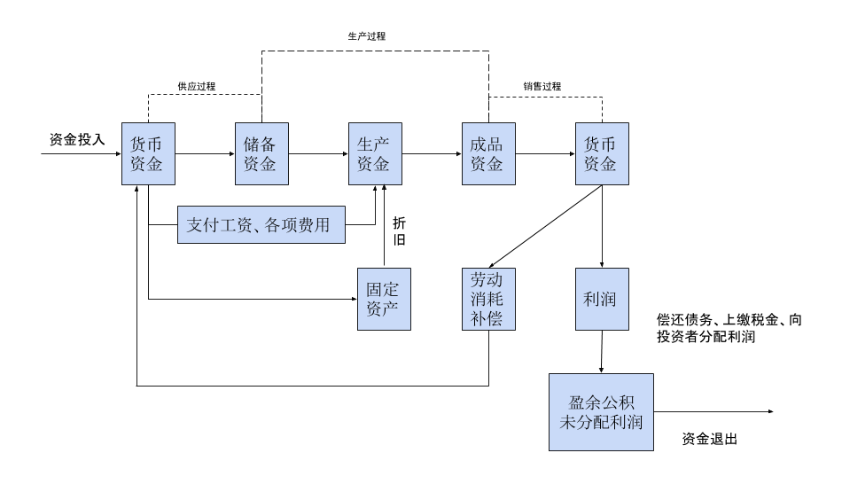

# 会计的概念和目标

## 会计的概念

会计是以**货币**为主要计量单位，运用专门的方法，**核算和监督**一个单位经济活动的一种经济管理工作。

## 会计的基本概念

+ 会计是一种经济管理活动
+ 会计是一个经济管理系统
+ 会计是以货币作为主要计量单位
+ 会计具有核算和监督的基本职能
+ 会计采用一系列专门的方法

## 会计的历史

**复式记账法**是会计最为重要的方法。

成本会计的出现和不断完善，在此基础上的**管理会计**（面向内部）和**财务会计**（面向外部）分离标志着现代会计的开端。

## 会计的对象

会计的对象是指会计核算和监督的**内容**，凡是特定主体能够以货币表现的经济活动，都是会计核算和监督的内容。

+ 会计不能核算和监督社会再生产过程中的**所有**经济活动
+ 会计对象就是能用货币表现的各种经济活动。通常又称为价值运动或者资金运动

企业的资金运动包括以下几个方面：

1. 资金的投入
2. 资金的循环与周转（资金的运用）
3. 资金的退出

**资金的投入**包括企业所有人投入的资金和债权人投入的资金两部分。前者属于企业所有者权益，后者属于企业债权人权益。资金的投入一部分构成了流动资金，一部分构成了非流动资金。

资金的投入是企业资金运动的**起点**。

**资金的循环和周转**是指资金运用于生产经营过程，分为了供应过程、生产过程、销售过程。

+ 供应过程是生产的准备阶段。在这个阶段需要购买并储存原材料等劳动对象，发生材料买价、运输费、装卸费等材料采购成本，与供应单位发生货款结算关系。资金从*货币资金*--->*储备资金*

+ 生产过程是产品的制造过程，又是资产的消耗过程。随着劳动对象的消耗，资金从*储备资金*--->*生产资金*，随着劳动力的消耗，资金从*货币资金*--->*生产资金*，随着成品的制成，资金从*生产资金*--->*成品资金*

+ 销售过程是产品价值的实现，资金从*成品资金*--->*货币资金*

这三个过程形成了一个闭环结构，资金周而复始不断循环。

**资金的退出**主要用于缴纳税费、偿还债务、分配股利或者利润以及留在企业中进行再生产。

<b>企业经营资金的循环和周转</b>

## 会计目标

向财务会计报告的使用者提供与企业财务状况、经营成果和现金流量等有关的会计信息。反映企业管理层受委托责任履行情况，有助于财务会计报告使用者做出经济决策。